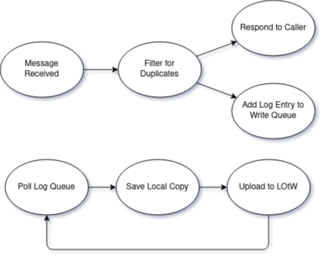

 

 

# VB3YEET Automated APRS Logger

This application is a part of *Meme Appreciation Month* and powers the automatic APRS messaging capabilities behind [VB3YEET](https://va3zza.com/yeet).

## Want in on the fun?

Between *June 25th 2022* and *August 5th 2022*, VB3YEET will be operating on the amateur radio bands along with a handful of other meme stations. If you are far away (or lazy) feel free to log an FM Digital contact with VB3YEET over APRS.

Simply send a message to the SSID `VB3YEET` with anything interesting in the message body (funny comments may find themselves published on my website). After a few seconds, you should receive a confirmation message, and sometime within the week, LOtW will be updated to contain your contact. EzPz.

## Application design

This thing is fairly simple. Designed to be a small binary I can drop on a random machine and forget about for a month. Rough design is as follows:

